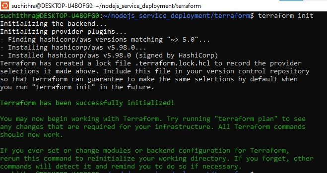
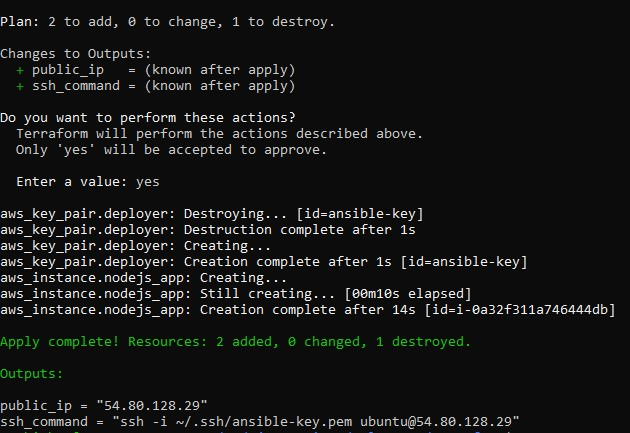
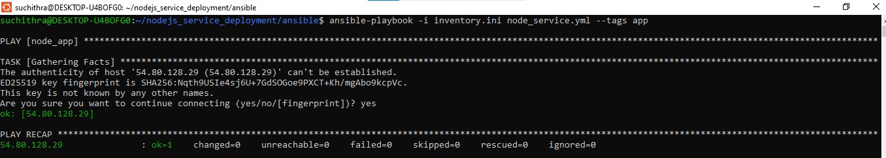
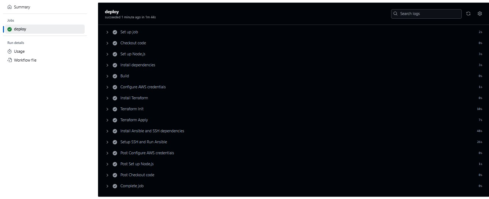
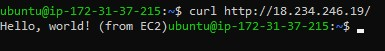
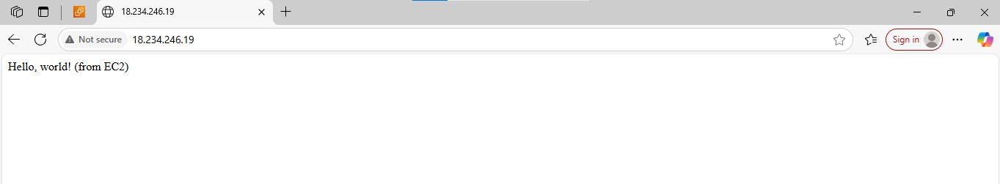
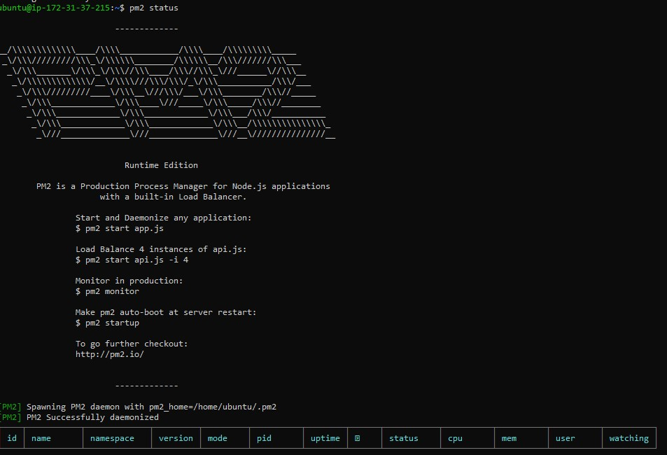

# Node.js Service Deployment (AWS + Terraform + Ansible + GithubActions)

This project demonstrates a complete CI/CD pipeline using **GitHub Actions**, deploying a **Node.js application**, managed with **PM2** to an **Ubuntu AWS EC2 instance** using **Terraform** and **Ansible**

---

## 1. Features

- Infrastructure as Code(IaC) using Terraform to provision AWS EC2 instance.
- Server setup and application deployment using Ansible.
- CI/CD using GithubActions for automated deployment.
- Uses SSH for secure communication and deployment.
- Simple Node.js app with one route for demonstration.
- Node.js app managed with PM2

---

## 2. Directory Structure
```
nodejs_service_deployment/
│
├── terraform/
│   ├── main.tf
│   ├── variables.tf
│   └── outputs.tf
│
├── ansible/
│   ├── inventory.ini        
│   ├── node_service.yml     # top-level playbook
│   └── roles/
│       └── app/
│           ├── tasks/
│           │   └── main.yml
│           └── templates/
│               └── ecosystem.config.js.j2
|
├── index.js
├── package.json
|
├── .github/
│    └── workflows/
│        └── deploy.yml
|
└── key.pem (in GitHub Secret)
|
├── images/ (screenshots)
└── README.md

```
---
## 3. CI/CD Workflow (GitHub Actions)

### Triggers:
- `push` to `main` branch

### Stages:
1. **Checkout Code**
2. **Install Node.js Dependencies**
3. **Terraform Apply**
4. **Ansible Playbook Execution**

## 4. Screenshots and Steps

###  Provision EC2 using Terraform

```
cd terraform
terraform init
terraform apply
```
#### Terraform init



#### Terraform apply



###  Ansible Playbook Execution



###  Secrets used:
> - `AWS_ACCESS_KEY_ID`
> - `AWS_SECRET_ACCESS_KEY`
> - `HOST_SSH_KEY` (contents of key.pem)

### GitHub Action: Workflow Triggered



## 5. Deployment URL

Node.js app will be available at:

    http://<ec2 instance public IP>

#### cURL cmd



#### Access through browser



## 6. PM2 

PM2 is a popular, production-grade process manager for Node.js applications. 

It helps to keep our apps alive forever, reload them without downtime, and simplify common system administration tasks.

### Key features of PM2:

- Process Management: Start, stop, restart, and monitor Node.js applications easily.
- Automatic Restarts: If the app crashes, PM2 will automatically restart it.
- Zero-Downtime Reloads: Update the app code and reload it without any downtime.
- Log Management: Aggregates and manages logs for all the processes.
- Startup Scripts: Configure the Node.js app to start automatically on server boot.
- Cluster Mode: Run multiple instances of the app to take advantage of multi-core systems.

### Example PM2 commands:

##### Start the app
        pm2 start index.js

##### List all running apps
        pm2 list

##### View logs
        pm2 logs

##### Status the app
        pm2 status



##### Restart the app
        pm2 restart index.js

##### Save the current process list for startup
        pm2 save

##### Generate startup script for server reboot
        pm2 startup


PM2 is widely used in Node.js production deployments for its reliability and ease of use.


